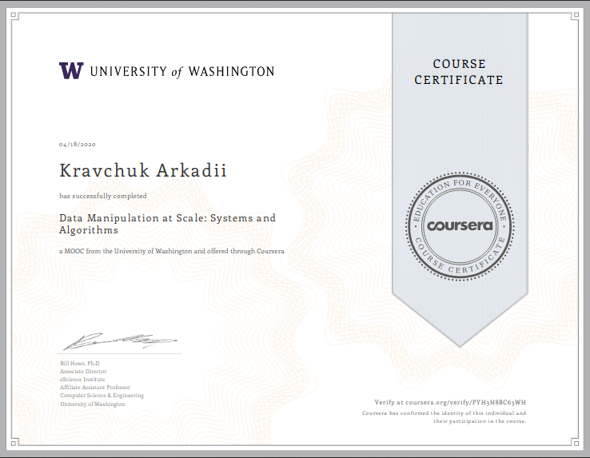

# Data Manipulation at Scale: Systems and Algorithms

## 1 week
[screenshots](week1/screenshots)

[code](week1/assignment)

## 2 week
[screenshots](week2/screenshots)

[code](week2/assignment)

## 3 week
[screenshots](week3/screenshots)

[code](week3/assignment)

## 4 week
[screenshots](week4/screenshots)

## results

[results (screenshots, documents, etc.)](results)

[certificate in .pdf](results/certificate.pdf)

[grades for course](results/grades.png)

## link to the certificate online

[https://coursera.org/share/a057294d02c28e76be732af52fc2f307](https://coursera.org/share/a057294d02c28e76be732af52fc2f307)
